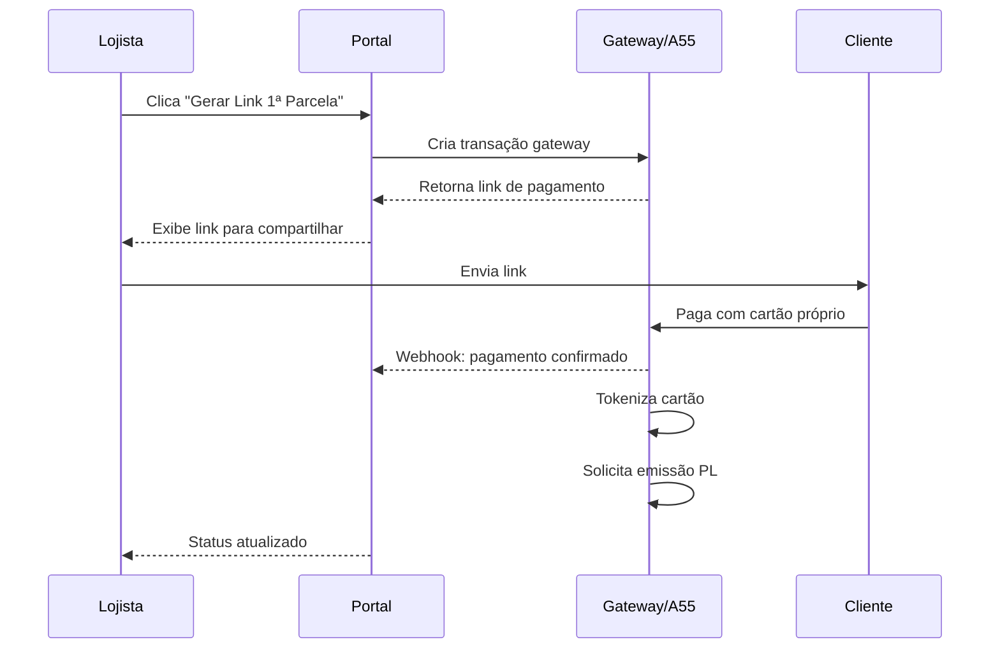

# Fluxo Cartão Private Label (PL) + Antecipação ao Lojista

> **Fonte de verdade** para o Portal do Lojista - Atualizado em Dez/2024

---

## Atores do Sistema

| Ator | Responsabilidade |
|------|------------------|
| **LOJISTA** | Opera o portal, cria contratos, acompanha status e antecipações |
| **CLIENTE FINAL** | Contrata serviço, paga parcelas, recebe cartão PL |
| **GATEWAY / A55** | Gera link pagamento, processa 1ª parcela, tokeniza cartão, comanda emissão PL, mantém escrow, tenta cobrança tokenizada |
| **BIZ** | Controla status de parcelas, emite/processa cartão PL, comunica elegibilidade, repassa pagamentos ao fundo |
| **FIDC / FUNDO** | Realiza desembolso/antecipação ao lojista, recebe repasses |
| **ESCROW** | Conta-reserva com 30% do valor antecipado |
| **BANCO OMNI** | Fornece liquidez via cota sênior do fundo |

---

## Conceitos-Chave (Regras do Produto)

1. A **1ª parcela** do contrato é paga **FORA do PL**, via adquirência convencional (gateway cria link e processa)
2. O gateway confirma a transação, **tokeniza o cartão** do cliente e comanda a **geração do Cartão PL**
3. A **2ª parcela** do contrato é a **1ª fatura do Cartão PL** (marco de elegibilidade)
4. Se o cliente **NÃO pagar** a fatura do PL → **NÃO há antecipação** ao lojista
5. Se o cliente **pagar** a fatura do PL → ocorre **desembolso/antecipação** com split:
   - **70%** para o lojista
   - **30%** para escrow (garantia)
6. Em inadimplência, há tentativa de cobrança no cartão tokenizado e pode haver uso da escrow

---

## Fluxo Principal (End-to-End)

### ETAPA 0 — Contrato do Serviço

O lojista fecha um **contrato de serviço** com o cliente final.

**Dados do contrato:**
- Valor total
- Quantidade de parcelas
- Datas de vencimento
- Identificação do cliente (nome, CPF, contato)

**Status inicial:** `pending_first_installment`

---

### ETAPA 1 — 1ª Parcela (Fora do PL) via Gateway

**Resultado da Etapa 1 (registrar):**
- Pagamento da 1ª parcela: status, timestamps, valor
- Token do cartão associado ao cliente
- Solicitação de emissão do Cartão PL

**Eventos:** `PaymentLinkCreated`, `PaymentCaptured`, `CardTokenized`, `CardPLIssuedRequested`

**Status após:** `pending_second_installment`

---

### ETAPA 2 — Cartão PL Emitido

- BIZ/Processadora emite o Cartão PL para o cliente
- O cartão representa o saldo do serviço vendido (valor restante do contrato)
- 1ª parcela paga compõe cota subordinada do fundo

**Evento:** `CardPLIssued`

---

### ETAPA 3 — 2ª Parcela = 1ª Fatura do PL (Marco de Elegibilidade)

Chega o vencimento da 2ª parcela (primeira fatura do PL).

**Decisão: Cliente pagou a 1ª fatura do PL?**

| Resultado | Próxima Etapa |
|-----------|---------------|
| **SIM** (em dia) | `eligible` → Etapa 4 |
| **SIM** (com atraso ≤60d) | `eligible_late` → Etapa 4 |
| **NÃO** | `ineligible` → Etapa 5 |

**Evento:** `InstallmentPaid` ou `InstallmentOverdue`

---

### ETAPA 4 — Antecipação / Desembolso ao Lojista (Split 70/30)

**Condição:** cliente pagou a 1ª fatura do PL

1. FIDC realiza desembolso referente ao contrato
2. Split automático:
   - **70%** → conta do lojista
   - **30%** → escrow (reserva)

**O lojista vê no portal:**
- Card "Antecipado (70%)" com valor
- Card "Escrow (30%)" com saldo
- Extrato com entradas e motivo
- Status do contrato: `disbursed`

**Eventos:** `EligibilityAchieved`, `AdvanceDisbursed`, `EscrowCredited`

---

### ETAPA 5 — Inadimplência / Não Pagamento

**Condição:** cliente não pagou a fatura do PL

1. **NÃO antecipa** parcelas ao lojista
2. A55 tenta cobrança no cartão tokenizado (até 3 tentativas)
3. BIZ sinaliza contrato como "em atraso"
4. Se aplicável: drawdown da escrow para cobrir inadimplência

**O lojista vê no portal:**
- Status parcela: "ATRASADA" / "EM COBRANÇA"
- Tentativas de cobrança registradas
- Alertas de risco
- Impacto na escrow (se houver drawdown)

**Eventos:** `InstallmentOverdue`, `CollectionAttempted`, `CollectionFailed`, `EscrowDebited`

---

### ETAPA 6 — Clientes em Dia

O lojista visualiza lista de clientes:
- **Em dia:** podem continuar o serviço contratado
- **Em atraso:** aparecem com bloqueio/alerta

---

## Estados do Contrato (eligibilityStatus)

| Status | Descrição | Ações Disponíveis |
|--------|-----------|-------------------|
| `pending_first_installment` | Aguardando pagamento da 1ª parcela | Gerar Link Pagamento |
| `pending_second_installment` | 1ª paga, aguardando 2ª (fatura PL) | Aguardar |
| `eligible` | 2ª paga em dia, elegível para antecipação | Solicitar Antecipação |
| `eligible_late` | 2ª paga com atraso ≤60d | Solicitar Antecipação |
| `ineligible` | 2ª não paga ou atraso >60d | Tentar Cobrança |
| `disbursed` | Já antecipado pelo FIDC | Ver Extrato |

---

## Eventos de Auditoria (DomainEvent)

| Evento | Source | Descrição |
|--------|--------|-----------|
| `gateway.payment_link.created` | a55 | Link de pagamento gerado |
| `gateway.transaction.captured` | gateway | Pagamento confirmado |
| `gateway.card.tokenized` | gateway | Cartão tokenizado |
| `biz.pl_card.issued` | biz | Cartão PL emitido |
| `biz.installment.paid` | biz | Parcela paga |
| `biz.installment.late` | biz | Parcela em atraso |
| `biz.disbursement.eligible` | biz | Elegível para antecipação |
| `a55.disbursement.requested` | a55 | Antecipação solicitada |
| `a55.disbursement.posted` | a55 | Antecipação efetivada |
| `a55.escrow.credited` | a55 | Crédito na escrow |
| `a55.escrow.drawdown` | a55 | Débito na escrow |
| `a55.fallback_charge.attempted` | a55 | Tentativa cobrança token |
| `a55.fallback_charge.success` | a55 | Cobrança token sucesso |
| `a55.fallback_charge.failed` | a55 | Cobrança token falhou |

---

## Prioridades de Implementação

### P0 — MVP Operável
1. Contratos (CRUD completo) + Clientes (mínimo)
2. Parcelas do contrato (geração/visualização + status)
3. Cobrança da 1ª parcela (gerar link, registrar pagamento)
4. Tokenização + emissão PL (representação no sistema)
5. Cobrança 2ª parcela + regra de elegibilidade
6. Antecipação + split 70/30 + extrato

### P1 — Operação Amarrada
7. Monitoramento de atrasos + alertas
8. Tentativas de cobrança no token
9. Lista "clientes em dia"
10. Timeline de eventos completa

### P2 — Hardening
11. Jobs de reconciliação e idempotência
12. Testes e2e completos
13. Acessibilidade e mobile-first
14. Microcopy e UI premium

